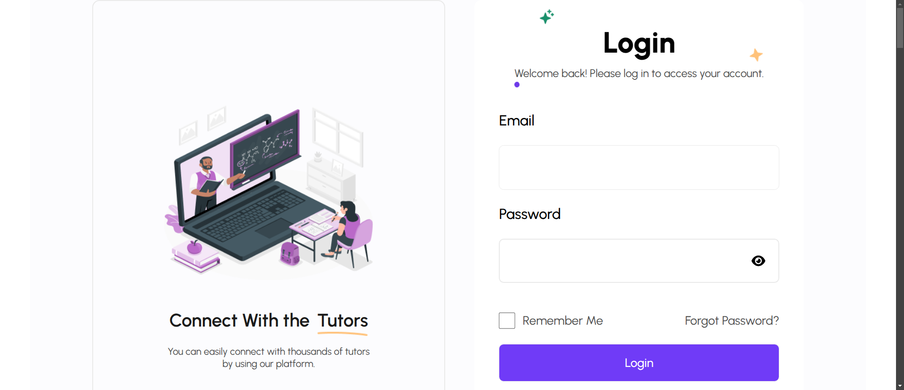
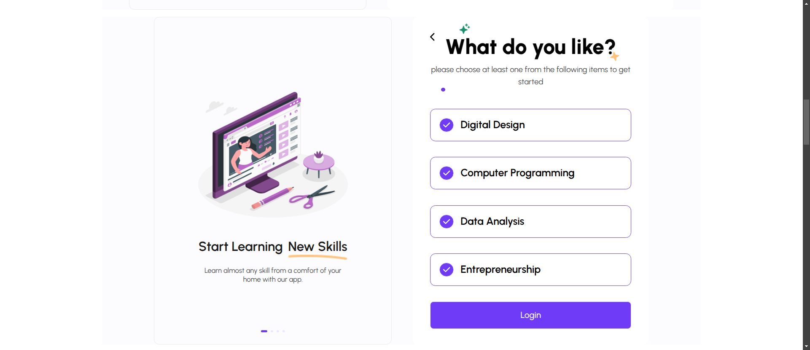
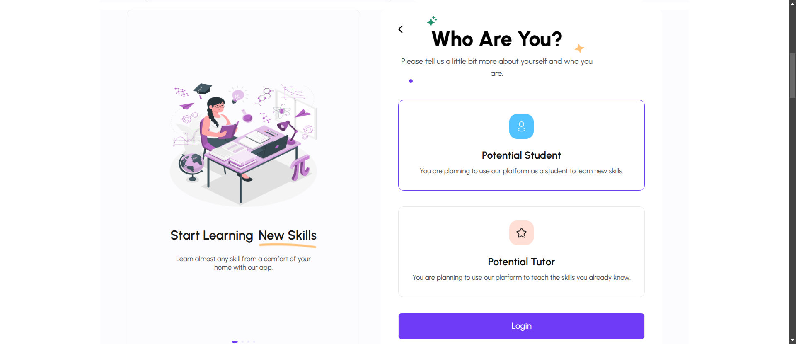
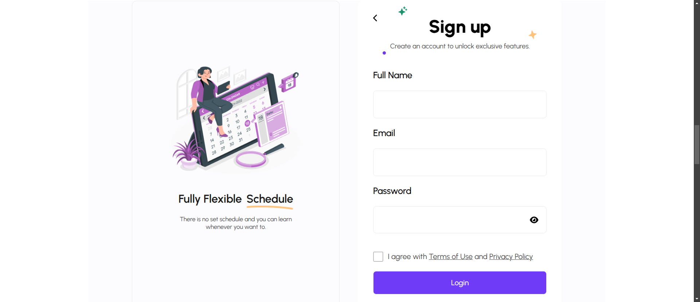
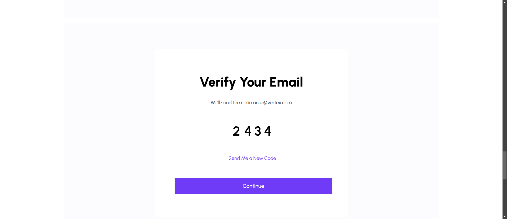
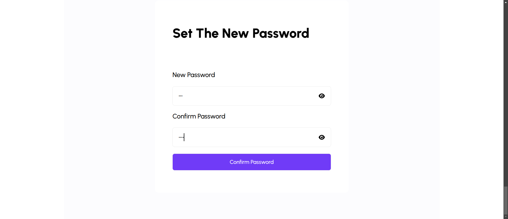
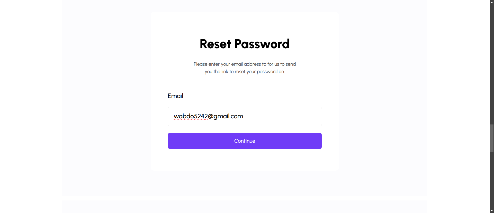

# Login Skillify

## Table of Contents

  

- [Table of Contents](#table-of-contents)

- [👋Introduction](#introduction)

- [🌟Features](#features)

- [🚀 Live Project](#-live-project)

- [📸 Screenshots](#-screenshots)
  - [Login Page](#Login-Page)
  - [What Do You Like Page](#What-Do-You-Like-Page)
  - [Who Are You Page](#Who-Are-You-Page)
  - [Sign Up Page](#Sign-Up-Page)
  - [Verify Page](#Verify-Page)
  - [Set New Password Page](#Set-New-Password-Page)
  - [Reset Password Page](#Reset-Password-Page)

- [💡Technique Skills](#Technique-skills)

- [🛠️Technologies Used](#️technologies-used)

- [🏁Getting Started](#getting-started)

- [⬇️Installation](#️installation)

- [🔧Usage](#usage)

- [📄License](#license)

  

## 👋Introduction
Login Skillify This is a login/signup system called  that provides a comprehensive authentication flow with a modern UI built using React, TypeScript, and Tailwind CSS. It focuses on user onboarding for a learning platform where users can be either students or tutors.
  

  

## 🌟Features

 1. Authentication Flow
- Login functionality with email/password and Google OAuth
- Sign up process with email verification
- Password reset/recovery system
- Email verification with code input
2. User Onboarding
- Role selection (WhoAreYou component)
 * Potential Student
 * Potential Tutor
- Interest selection (DoYouLike component)
* Digital Design
* Computer Programming
* Data Analysis
* Entrepreneurship
3. Security Features
- Password visibility toggle
- Form validation
- Secure password reset flow


## 🚀 Live project


[ Login Skillfy](https://login-skillfy.vercel.app)

  

## 📸 Screenshots


### Login Page



### What Do You Like Page



### Who Are You Page



### Sign Up Page



### Verify Page



### Set New Password Page



### Reset Password Page




## 💡Technique Skills


- **TypeScript**
i used TypeScript for type safety
```
const Btn = ({ style, children }:{style?:string, children:React.ReactNode})...
```
```
type CardProfileProps ={
[key:string]:string
}
const CardProfile = ({ img, caption, specialWord, desc }:CardProfileProps)...
```
```
const Header = ({caption ,desc}:{caption:string,desc:string})...
```

```
  const [likes, setLikes] = useState<string[]>([]);
    function handleLikesItem(text:string) :void{
    setLikes((prev) => {
      return [...prev, text];
    });
  }
```

```
  function handleSubmit(e:React.FormEvent<HTMLFormElement>)...


  function Item({ text, likes ,i ,setLikes ,handleLikesItem}:{text:string,likes:string[],i:number,setLikes:React.Dispatch<React.SetStateAction<string[]>> , handleLikesItem: (text:string)=> void}) 


  const [dataForm, setDataFrom] = useState<{ Email: string, Password: string, Rmember:string}>({} as { Email: string, Password: string, Rmember:string});
  function handleSubmit(e:React.FormEvent<HTMLFormElement>) :void{
```
- **Reusable Button**
created reusable Button component like Btn.

```

const Btn = ({ style, children }:{style?:string, children:React.ReactNode}) => {
  return (
    <button
      className={` ${style} cursor-pointer  btn bg-purpel hover:bg-[#692ffe] `}
    > 
      {children}
    </button>
  );
};

export default Btn;


```
- **State Mangement**
i used use state for manage local data


- **style**
i used use tailwindcss for style


- **icon**
i used use fontawesome for icon

- **javaScript and ES6**
```
{Array.from({ length: 4 }, (_, i) => i).map((index) => {
            return <Input key={index} />;
          })}
```
- **Reusable Components**
created reusable components like CardProfile.
```
type CardProfileProps ={
[key:string]:string
}
const CardProfile = ({ img, caption, specialWord, desc }:CardProfileProps) => {
  return (
    <div className="bg-mainWhite  self-stretch  py-[30px]  relative px-11 text-center rounded-xl  border-[#EAEAEA] border-2 ">
      
      <div className=" mx-auto mb-24  ">
        <h1 className="text-[#1a1a1a] flex text-center flex-wrap gap-3  pb-4 justify-center text-3xl font-semibold ">
          {caption}
          <span className="flex flex-col justify-start  items-start w-fit ">
            {specialWord} 
          </span>
        </h1>
        <p
          className="text-[#4D4D4D] mx-auto text-center
         font-normal text-[18px] leading-5 w-[70%]"
        >
          {desc}
        </p>
      </div>
      <div className=" flex justify-center items-center space-x-2 absolute bottom-[30px] left-1/2 -translate-x-1/2">
        <span className=" bg-purpel w-[16px] h-[6px] rounded-full t duration-200 "></span>
        <span className="  bg-[#EDE7FE] w-[6px] h-[6px] rounded-full "></span>
        <span className=" bg-[#EDE7FE] w-[6px] h-[6px] rounded-full "></span>
        <span className=" bg-[#EDE7FE] w-[6px] h-[6px] rounded-full "></span>
      </div>
    </div>
  );
};

export default CardProfile;


```

## 🛠️Technologies Used

  

The Login Skillfy project utilizes the following technologies:

  

-    &nbsp;  &nbsp;[Html](https://html.com/)

-    &nbsp;  &nbsp;[Css](https://www.w3.org/Style/CSS/Overview.en.html)

-    &nbsp;  &nbsp;[React](https://reactjs.org/)

-    &nbsp;  &nbsp;[TypeScript](https://www.typescriptlang.org/)

-    &nbsp;  &nbsp;[Fontawesome](https://fontawesome.com/)

-    &nbsp;  &nbsp;[Tailwindcss](https://tailwindcss.com/)


## 🏁Getting Started

  

To set up the Login Skillfy project locally, follow the instructions below.

  

## ⬇️Installation

  

To set up the project locally, follow these steps:

  

1. Clone the repository:

  

```bash

git clone https://github.com/Abdelrahman-wahed/login-skillfy.git

```

  

2. Navigate to the project directory:

```bash

cd login-skillfy

```

  

3. Install the required dependencies:

  

```bash

npm install

```

  

## 🔧Usage

  

1. Run the development server:

  

```bash

npm run dev

```

  

2. Open your browser and go to `http://localhost:5173/` to view the application.

  

## License

  

This project is licensed under the MIT License - see the [LICENSE](LICENSE.md) file for details.
